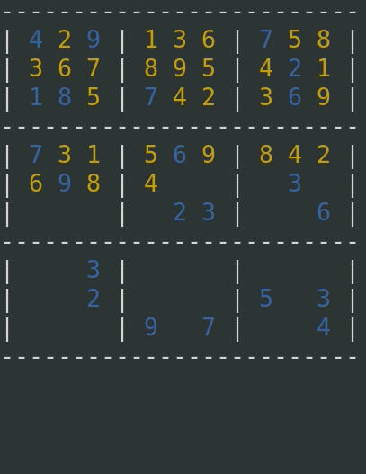

# sudoku-solver
A simple solver for Sudoku written in Python.

## Introduction
sudoku-solver is capable of solving any given Sudoko board. It could also, with some modfications, be used in order to create Sudoku boards as well.

## Requirements

* Python 3 (developed/tested with 3.8)

The operating system needs to support the [curses module](https://docs.python.org/3/howto/curses.html). 

## How to use it
sudoku-solver runs in the terminal. Python 3 is required to run the program.

Before running the program, a desired board to solve can be set in the `main.py` file. It can then be started by issuing the following command:

    $ python3 /path/to/main.py

The solving progress is visualized step by step. The current default speed is around 1000 guesses per second.
